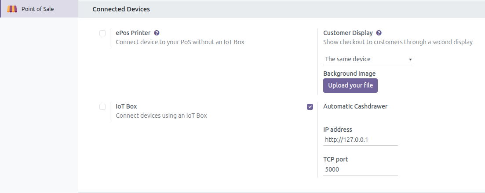
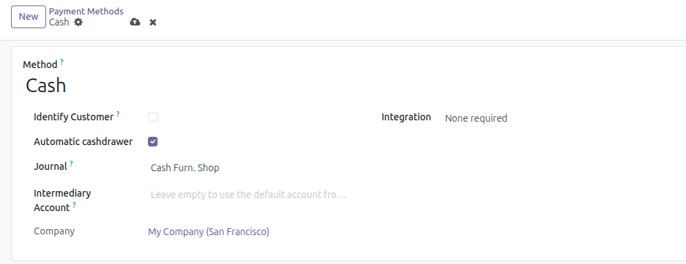

- Go to Point of Sale > Configuration > Settings, in `Connected Devices` section,
enable Automation Cashdrawer and fill IP Address, TCP Port.

- Go to Point of Sale > Configuration > Payment Methods, with `Cash` type, enable `Automation Cashdrawer`.

