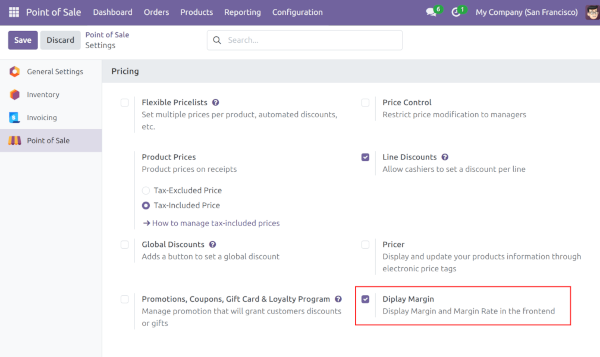

- If you want to disable the display of the margin, in the front-office
  UI, you can uncheck the check box in the res.config.settings shop
  form. For that, go to Point of Sale / Configuration / Settings, and search the "Diplay Margin" field.

