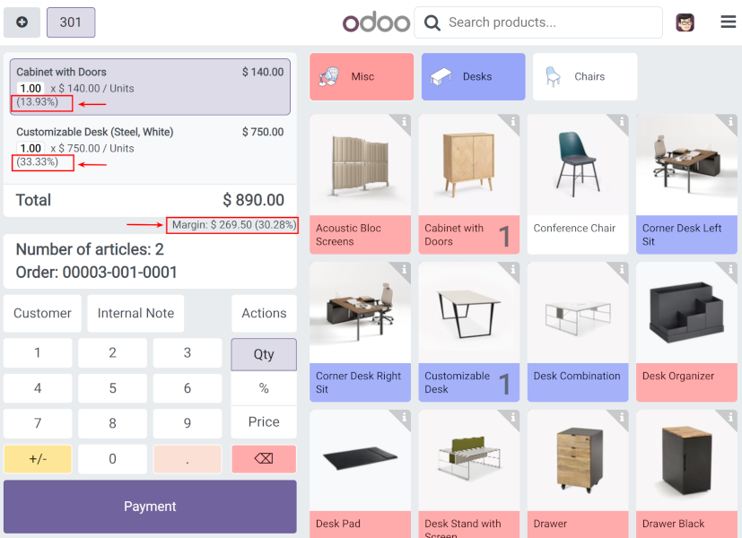

This module shows margins in PoS frontend during an order creation.

Margins are displayed below the final price of the POS order and under each pos order line. 

This module also adds the margin fields to some secondary views. The margin rate (%) is included in the POS order report, while the margin amount is displayed in the POS order tree view.
