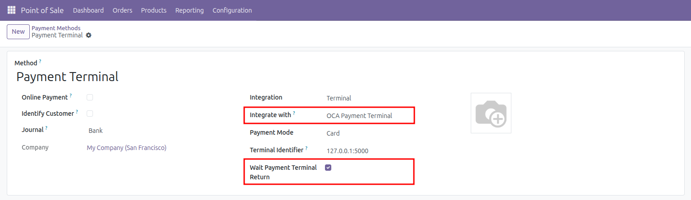

- Go to *Point of Sale \> Configuration \> Payment Methods*, edit the
payment method corresponding to the card reader and set the field *Use
a payment terminal* to *OCA Payment Terminal*.
A new field *Wait Payment Terminal Return* will appear.

