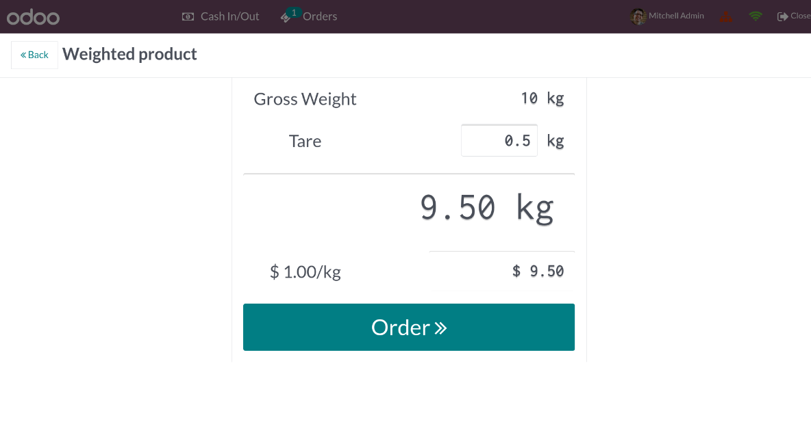
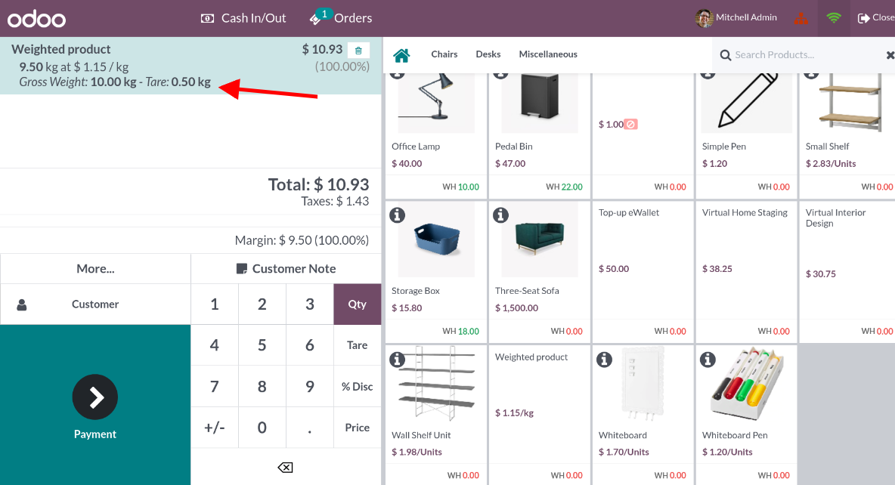
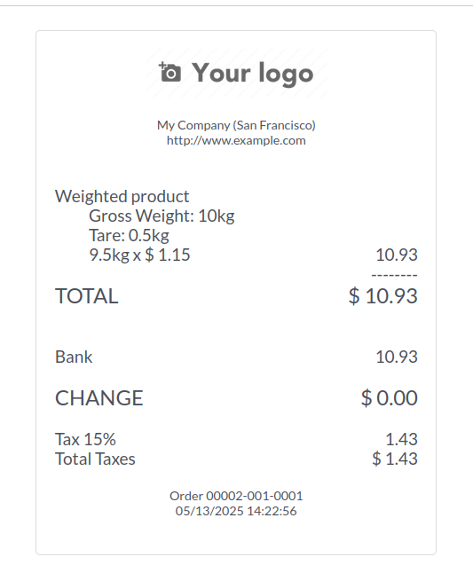

Allow to enter a tare weight when weighing products in the Point of Sale.
This will compute the net weight automatically and set it on the currently selected order line.

The net weight is displayed in the order with the tare value below it.

This information is also displayed on the receipt.

