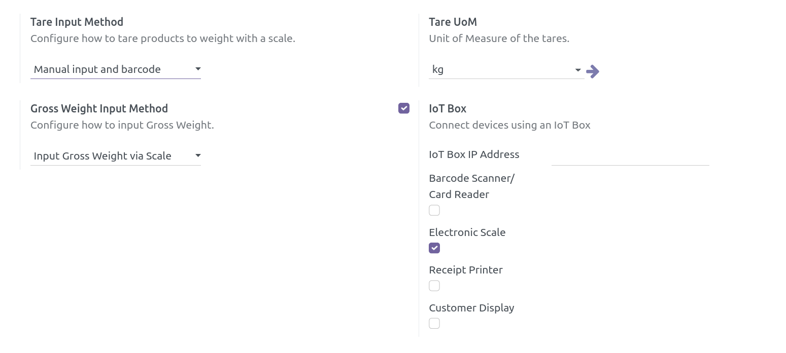
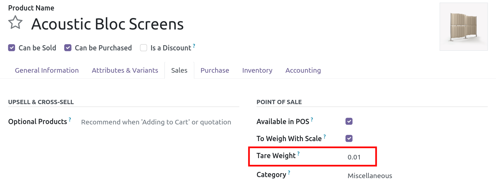

Install this module and configure the point of sale.
To enable this addon, go to the point of sale configuration page.
There, enable the electronic scale and barcode reader in the "IoT Box" section.
In the same page, look for the "Tare Input Method" field, and choose a tare method.
There are three tare methods:

- "Manual": allows to enter the tare value when a product is weighed
- "Barcode": allows to scan a barcode containing the tare value
- "Both": allows both of the above methods

To handle tare barcodes you need to use the `default barcode nomenclature <https://www.odoo.com/documentation/16.0/applications/inventory_and_mrp/barcode/operations/barcode_nomenclature.html>`__.
The default tare barcode rule is an EAN-13 barcode of the form ``0700000{NNDDD}`` (where ``N`` will encode the kilograms units and ``D`` the decimals).
Using that pattern, the barcode for a tare of 1.234 kg is ``0700000012347`` (the last digit is the EAN-13 check digit).
This barcode rule can be modified if needed, and other ones added.

The ``pos_self_service_weighing_tare`` module allows to weigh containers and create tare barcode labels from a PoS configured as a self-service weighing station.

You can define a default tare on the product form view, if you always use the same type of packaging (or container) for a given product.

.. note::
   If a product with a different UoM category than the one used for the tare is set to be weighed with a scale, an error message will appear when a tare is set, as the weight cannot be computed.
